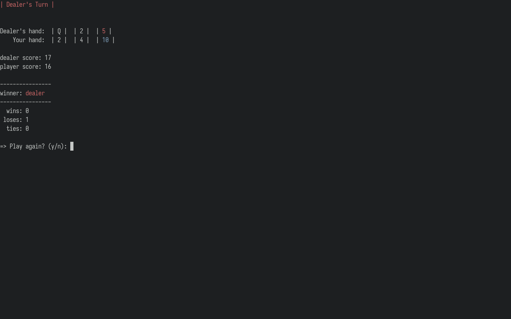

# twenty-one



## About

`twenty-one` is a simple terminal Twenty One card game ([click here to learn the rules of Twenty One](https://ourpastimes.com/21-card-game-rules-6735219.html)) with a colorized interface, where the player competes against the dealer (computer).

Hits are colorized, and cards in the player's hand are sorted by value. Wins, loses, and ties are also tracked.

## Dependencies

`twenty-one` requires the following:

- `Ruby (>= 2.5.5)` (The programming language `twenty-one` is written in. See [the official Ruby installation procedures](https://www.ruby-lang.org/en/documentation/installation/).)

- `bundler` (A Ruby gem for handling project dependencies. Install by running `$ gem install bundler` after `Ruby` has been installed.)

## Installation

To install `twenty-one`, simply clone this repository to your machine, navigate to the `twenty-one` folder created, and use `bundler` to install the needed dependencies as shown below:

```
$ git clone https://github.com/loreandstory/twenty-one.git
$ cd twenty-one/
$ bundle install
```

## Running

You must be `cd`'d into the `twenty-one` folder and execute `play.sh` to play:

```
$ cd /path/to/twenty-one/
$ ./play.sh
```

Note that you can exit the game at any time by pressing `Ctrl-c`. Otherwise, you may enter `n` at the end of each round to exit, or enter `y` to play another round.
